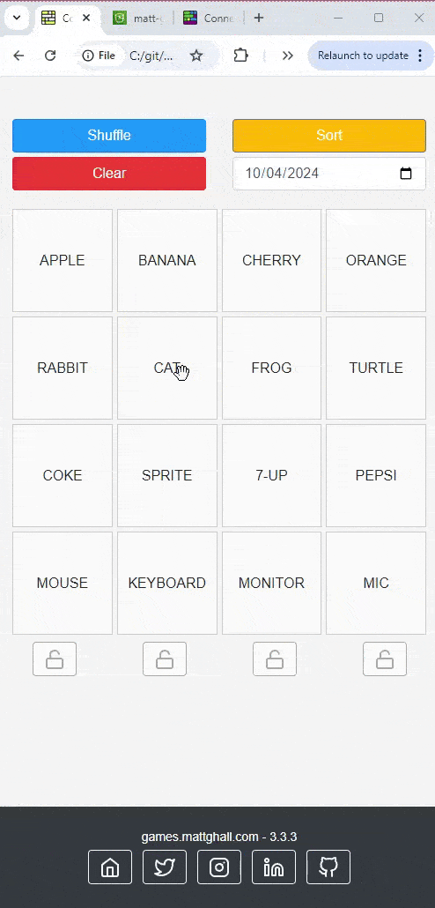
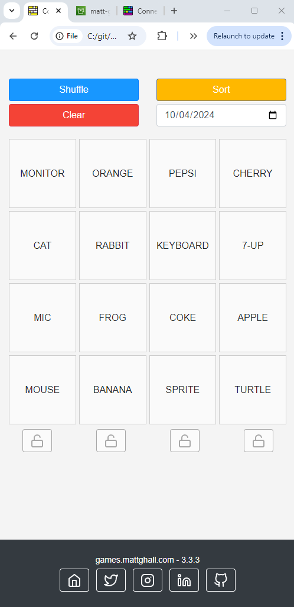
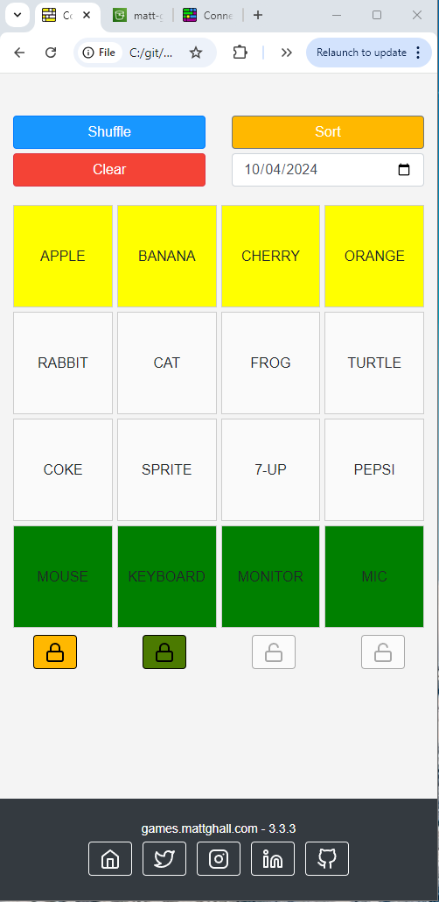

# Connections Helper
<div style="display: flex; justify-content: space-between;">
    <div>
        
    </div>
    <div style="max-width: 50%;">
        <p>A web-based interactive game inspired by the New York Times Connections. This game allows users to shuffle, sort, and reset boxes in a grid while maintaining color and state properties. The game is built using HTML, CSS, and JavaScript.</p>
        <h2>Gameplay</h2>
        <ul>
            <li><strong>Load in Data from NYT Connections</strong>: The game loads data from the New York Times Connections app via a Lambda function. If data can't be read from NYT for some reason, default words are displayed.</li>
            <li><strong>Shuffle Boxes</strong>: Randomly shuffles the boxes in the grid.</li>
            <li><strong>Try Different Dates</strong>: Users can try different dates to load the corresponding default words and play the game with historical data.</li>
            <li><strong>Sort Boxes</strong>: Sorts boxes by color and fills the remaining spaces with white boxes.</li>
            <li><strong>Clear Board</strong>: Resets the board by clearing all guesses and setting the boxes back to their default white state.</li>
            <li><strong>Drag and Drop</strong>: Allows users to drag and drop boxes to reorder them within the grid.</li>
            <li><strong>Box States</strong>: Each box has two states - guess and confirmed. The color and opacity of the box change depending on the state.</li>
            <li><strong>Color Locks</strong>: There are four colored locks below the grid where you can "lock in" correct answers. These "locked" colors will no longer show up as options for the remaining boxes.</li>
        </ul>
    </div>
</div>

## Screenshots
<div style="display: flex; justify-content: space-around;">
    
    
</div>


## Development
### Project Structure
- **index.html**: The main HTML file that sets up the structure of the game.
- **webpack.config.js**: The Webpack config
- **src/style/styles.css**: Contains all the CSS styles for the game.
- **src/js/main.js**: The main JavaScript file that handles the game logic.
- **src/js/logger.js**: A small js file for logging.

NYT data can't be downloaded locally due to COORs so I load in a default 12 words if the NYT request fails.

## Webpack Configuration Overview:
### Entry Point:

The entry point defines the file where Webpack starts the bundling process. In this case:
```js
entry: {
    main: './src/js/main.js',
}
```

Webpack will begin bundling from main.js, and this file is treated as the main starting point of your application.

### Output:

The output section determines where and how the bundled files are saved:
```js 
output: {
   filename: '[name].bundle.js',
   path: path.resolve(__dirname, 'dist/js'),
}
```

filename: The [name] placeholder in the filename is replaced with the key from the entry object. Since the entry is main, it outputs main.bundle.js.
path: The bundled files will be saved in the dist/js directory.

### Module Rules:

The rules section tells Webpack how to handle different file types during the build process. In this case, it’s focused on processing CSS files:

```js
module: {
   rules: [
      {
         test: /\.css$/,
         use: [
            MiniCssExtractPlugin.loader,
            'css-loader',
         ],
      },
   ],
}
```
* test: This regular expression checks for .css files.
* use: The loaders specified here are responsible for handling .css files:
    * MiniCssExtractPlugin.loader: Extracts CSS into separate files instead of embedding them in JavaScript.
    * css-loader: Interprets @import and url() statements in CSS and resolves them.

### Plugins:

Webpack plugins extend the functionality of the build process. Here, you use the MiniCssExtractPlugin to manage CSS extraction:

```js
plugins: [
   new MiniCssExtractPlugin({
      filename: '../style/[name].css',
   }),
]
```
This plugin ensures that CSS files are extracted into their own files, which are saved in the dist/style directory as [name].css (e.g., main.css).

### Mode:

The mode is set to production:
```js
mode: 'production',
```

This enables optimizations like minification and tree-shaking for smaller and faster bundles.

### Source Maps:

Source maps help with debugging by mapping the minified code back to the original source. Keep commented out for production deployment.
```js
devtool: 'source-map',
```
Webpack would generate source maps for your bundled code, helping you debug the original source files in the browser’s developer tools.

## Builds
run `npm run build` to build the latest version of all the modified files. This will update the files in your minified dist directory. You can also run a `npm run clean` to remove any outdated files.

## Deployment to AWS
The following files need to be copied into the s3 bucket
* The full `dep` directory with dependencies.
* the full `dist` directory with the minified js/css files
* `index.html` obviously
* A version of `favicon.ico`. I like to keep production and local different colors to easily distinguish between them so be careful before overwriting.


## Future Additions
- Allow for creating your own game to share with friends